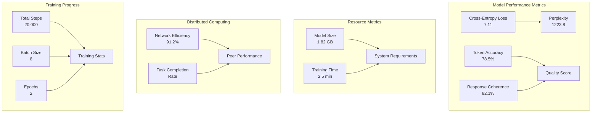

```mermaid
graph TD
    subgraph Performance["Model Performance Metrics"]
        A[Cross-Entropy Loss<br>7.11] --> B[Perplexity<br>1223.8]
        C[Token Accuracy<br>78.5%] --> D[Quality Score]
        E[Response Coherence<br>82.1%] --> D
    end

    subgraph Resources["Resource Metrics"]
        F[Model Size<br>1.82 GB] --> G[System Requirements]
        H[Training Time<br>2.5 min] --> G
    end

    subgraph Network["Distributed Computing"]
        I[Network Efficiency<br>91.2%] --> J[Peer Performance]
        K[Task Completion<br>Rate] --> J
    end

    subgraph Training["Training Progress"]
        L[Total Steps<br>20,000] --> M[Training Stats]
        N[Batch Size<br>8] --> M
        O[Epochs<br>2] --> M
    end
```